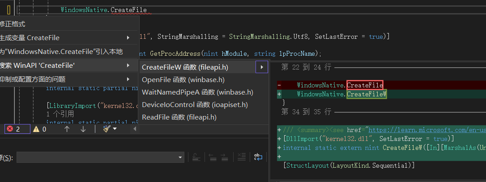

# WinAPI Importer

[zh-CN](./README.md) | [en-US](./README.en-US.md)

向C#程序员提供WinAPI的简单声明方式。

_(目前扩展还处于预览版)_

### 用法

1. 声明一个`Attribute`类来标记装载WinAPI函数的类，属性类的名称应该是`WindowsAPIAttribute`。
2. 声明一个类，并为它加上`[WindowsAPI]`标注，类的访问修饰符会决定生成函数的访问修饰符，例如：
    ```cs
    [WindowsAPI]
    internal static class WindowsNative
    {
        static WindowsNative()
        {
            if (!RuntimeInformation.IsOSPlatform(OSPlatform.Windows))
                throw new PlatformNotSupportedException(ET("当前模块仅支持在Windows上生效"));
        }
    }
    ```
3. 在当前工程的任何位置键入`className.functionName`，并按下`Alt+Enter`(快速操作)，在弹出菜单中选择 <**搜索 WinAPI 'functionName'**>，然后就可以预览生成的API函数了，如图：

